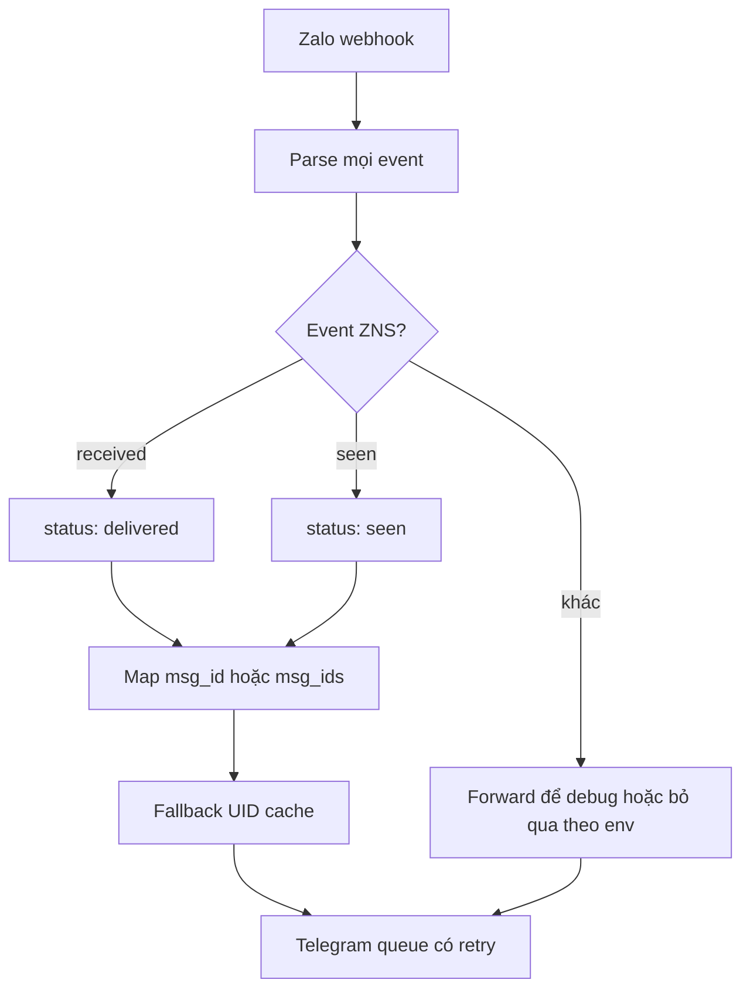

# Review data flow ZNS → Telegram và hướng dẫn cập nhật thủ công

## Kết luận

Telegram không làm mất payload. Dữ liệu đã bị cắt ngay trong `main.js` trước khi gọi Telegram:

1. Server log toàn bộ `req.body`, nên Terminal thấy đủ dữ liệu.
2. Code chỉ chấp nhận chính xác `event_name === "user_received_message"`.
3. `user_seen_message`, `user_send_text` và các event khác bị thay bằng object chỉ còn `notice` và `event_name`.
4. Telegram nhận đúng object rút gọn đó, nên chỉ hiển thị `Unhandled event`.

Ảnh test `user_seen_message` còn có `message.msg_ids[]`, trong khi code cũ chỉ đọc `message.msg_id`. Vì vậy chỉ mở thêm event mà không sửa parser vẫn không map được message.

> Lưu ý: nút **Gửi sự kiện** trên Zalo Developer đang dùng ID ví dụ như `This is message id`. ID ví dụ không tồn tại trong `.data/outbox.json`, nên không thể suy ra số điện thoại. Hãy test mapping bằng webhook thật phát sinh từ ZNS đã gửi qua `/zns/send-batch`, hoặc đăng ký `msg_id → phone_id` qua `/zns/outbox`.

## Data flow sau khi sửa



## Các lỗi/rủi ro tìm thấy

| Mức | Vấn đề | Tác động | Trạng thái trong gói sửa |
| --- | --- | --- | --- |
| P0 | Chỉ nhận `user_received_message` | `user_seen_message`/`user_send_*` mất toàn bộ chi tiết trước Telegram | Đã sửa |
| P0 | `.env`, dữ liệu mapping và Zalo access token đang được commit | Lộ Telegram token, chat ID, proxy, số điện thoại/UID và quyền gọi Zalo API | Cần rotate/xóa khỏi Git history ngay |
| P1 | Chỉ đọc `message.msg_id`, không đọc `message.msg_ids[]` | Event seen không map được ZNS đã gửi | Đã sửa |
| P1 | `pending_window` lấy người gửi gần nhất | Có thể gán nhầm số điện thoại khi batch/concurrent | Mặc định tắt; chỉ bật khi chấp nhận rủi ro |
| P1 | `sendToTelegram()` nuốt lỗi HTTP | Queue tưởng gửi thành công và làm mất event | Đã sửa, có retry tối đa |
| P1 | Queue chỉ nằm trong RAM | Restart/crash vẫn có thể làm mất event chưa gửi | Chưa xử lý; nên dùng Redis/BullMQ hoặc DB outbox nếu chạy production |
| P1 | Endpoint `/zns/send-batch`, `/zns/outbox`, `/debug/outbox` đang public | Có thể bị gọi trái phép hoặc lộ mapping | Đã thêm `ADMIN_API_KEY`; chỉ bắt buộc khi cấu hình key |
| P2 | Timestamp chỉ giả định millisecond | Timestamp 10 chữ số bị hiển thị năm 1970 | Đã sửa |
| P2 | Log raw webhook mặc định | Lộ PII trong log | Chuyển sang opt-in bằng `LOG_RAW_WEBHOOK=true` |

## File cần chép đè/thêm mới

Chép các file trong gói vào đúng thư mục của project:

- Chép đè: `main.js`, `package.json`, `.gitignore`.
- Chép đè: `utils/zalo.js`, `utils/telegram.js`, `utils/format.js`.
- Thêm mới: `.env.example`, `tests/zalo.test.js`.
- Không chép đè `.env` hiện tại; chỉ bổ sung biến còn thiếu theo `.env.example`.

## Biến môi trường khuyến nghị

```dotenv
FORWARD_OTHER_EVENTS=true
ALLOW_UNSAFE_PENDING_FALLBACK=false
TELEGRAM_MAX_RETRIES=3
LOG_RAW_WEBHOOK=false
ADMIN_API_KEY=<chuỗi-random-dài>
ZALO_ACCESS_TOKEN=<token-mới-sau-khi-rotate>
```

- Giữ `FORWARD_OTHER_EVENTS=true` trong lúc debug để Telegram vẫn nhận `user_send_text`, `user_send_audio`, v.v.
- Khi production chỉ cần tracking ZNS delivered/seen, đổi thành `false` để giảm nhiễu.
- Không bật `ALLOW_UNSAFE_PENDING_FALLBACK` nếu có gửi batch hoặc nhiều người nhận cùng lúc.

## Cập nhật và kiểm thử trên Windows/VS Code

1. Backup các file cũ.
2. Chép file từ gói sửa vào project theo đúng cấu trúc thư mục.
3. Mở `.env` và bổ sung các biến ở trên; không đưa token vào file curl hay commit Git.
4. Chạy:

```powershell
npm install
npm test
npm start
```

5. Kiểm tra health:

```powershell
Invoke-WebRequest http://localhost:3002/health
```

6. Trong Zalo Developer, gửi thử `user_seen_message`. Telegram phải nhận tối thiểu:

```json
{
  "event_name": "user_seen_message",
  "status": "seen",
  "tracked_zns_event": true,
  "user_id_by_app": "...",
  "msg_ids": ["..."],
  "_map_hit": false
}
```

`_map_hit: false` là đúng với ID mẫu của màn Zalo Developer. Muốn `_map_hit: true`, dùng `msg_id` thật đã lưu lúc gửi ZNS.

## Xử lý khẩn cấp secret/PII đã commit

Repository hiện là public. Cần làm theo thứ tự:

1. Thu hồi và tạo mới Telegram bot token, Zalo access token, proxy credential nếu có.
2. Không chỉ xóa file ở commit mới; secret cũ vẫn còn trong Git history.
3. Bỏ theo dõi file nhạy cảm ở commit hiện tại:

```powershell
git rm --cached .env
git rm -r --cached .data
git rm --cached curl/send_ZNS_ID482945.txt
git add .gitignore .env.example
git commit -m "security: remove committed secrets and PII"
```

4. Sau khi rotate secret, dùng `git filter-repo` hoặc BFG để purge lịch sử rồi force-push theo quy trình an toàn của repository.
5. Kiểm tra lại GitHub secret scanning và toàn bộ commit/tag/branch.

## Kiểm thử đã chạy trên gói sửa

- `node --check main.js`: PASS.
- `node --check utils/zalo.js`: PASS.
- `node --check utils/telegram.js`: PASS.
- `npm test`: 5/5 PASS cho parser các event và cơ chế báo lỗi/thành công của Telegram.

## Rủi ro còn lại trước production

- Chưa có persistent queue/dead-letter queue; restart tiến trình vẫn có thể mất event.
- Chưa có xác thực chữ ký webhook theo cơ chế chính thức của Zalo app/OA.
- Store dùng JSON file đồng bộ; không phù hợp multi-instance hoặc tải lớn.
- Cần test end-to-end bằng một ZNS thật và `msg_id` thật, không chỉ event simulator.
